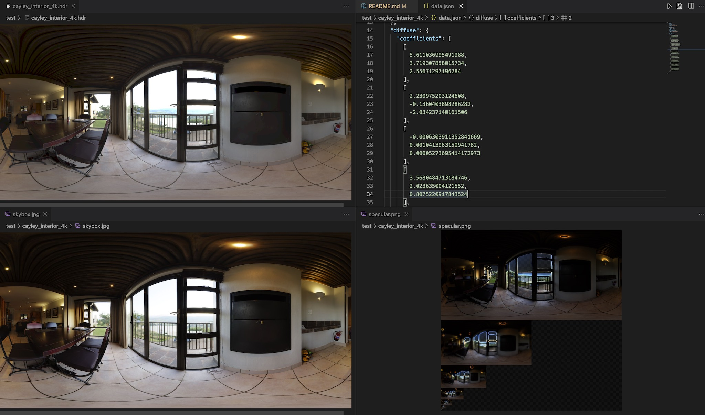

# xr-frame-cli

## 注意

此项目已废弃，请使用全新的可视化工具[XR-FRAME-TOOLKIT](https://github.com/dtysky/xr-frame-toolkit)替代！

## 原始文档

用于微信小程序内置的`xr-frame`系统的CLI，提供以下两个功能：

1. 通过环境贴图，生成`xr-frame`专用的`env-data`，包含`skybox`、`diffuse sh`和`specular map`，支持打包成单二进制文件。
2. 对`gltf`模型文件进行预处理，优化为`xr-frame`友好的数据结构，同时支持打包为`glb`，能大幅提升加载速度。

## 使用

首先安装：

```sh
npm i xr-frame-cli -g
```

之后可以使用下列指令：

### env-data

运行：

```sh
xr-frame env-data -h
```

可以看到所有支持的操作。

目前支持的输入格式为`['hdr', 'exr', 'png', 'jpg', 'jpeg', 'bmp', 'gif', 'tiff']`，要求输入图片比例近似`2:1`。

以`xr-frame env-data -i test/exr.exr`为例，原始图片和产物如下（`specular map`为`rgbd`编码）：




### gltf

运行：

```sh
xr-frame gltf -h
```

可以看到所有支持的操作。

>如果需要更进阶的优化，可以尝试使用[SeinJSUnityToolkit](https://github.com/hiloteam/SeinJSUnityToolkit)。注意如果要导出动画的话，不要勾选`Use SeinAnimator`。

## 开发测试

项目提供了一张图和一个模型用于开发测试。

### env-data

执行：

```sh
npm run dev && xr-frame env-data -i test/exr.exr
```

输出将会在`test/exr`目录下。

### gltf

执行：

```sh
npm run dev && xr-frame gltf -i test/gltf-sources/gltf/index.gltf -o test/gltf-dist
```

输出将会在`test/gltf-dist/gltf`目录下。
